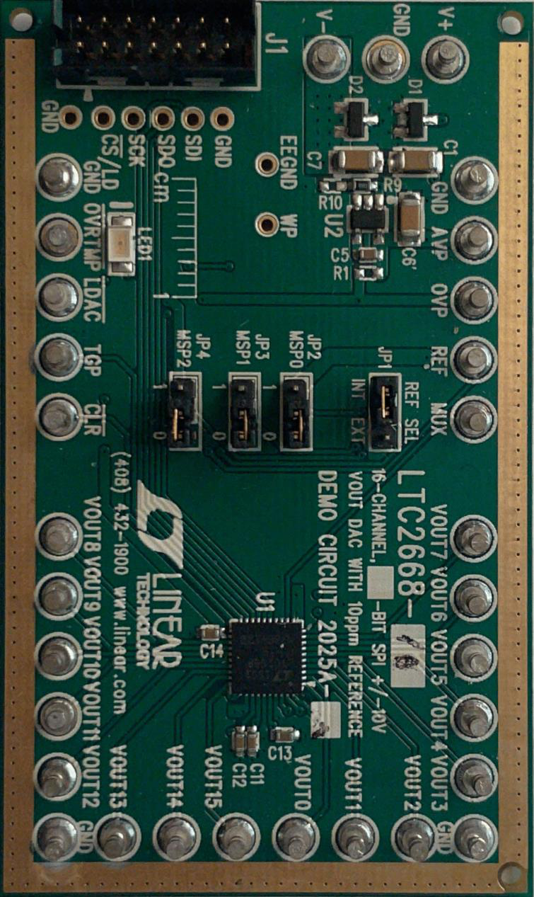
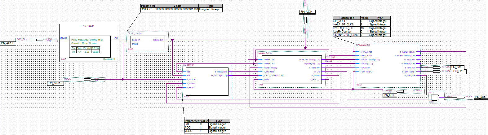
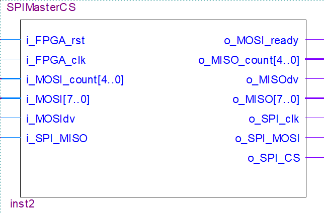
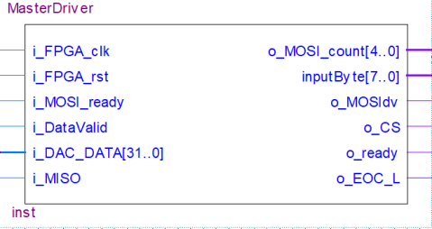
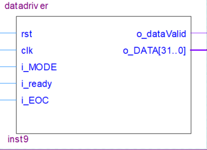
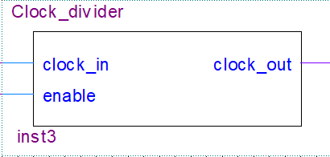

{width="6.338888888888889in"
height="10.63757874015748in"}{width="7.230555555555555in"
height="6.08046697287839in"}{width="7.236111111111111in"
height="1.7002613735783028in"}

> SPI Interface for\
> LTC2668 and LTC2494 August 5, 2021
>
> Weinel, Ben

Table of Contents

Introduction
\...\...\...\...\...\...\...\...\...\...\...\...\...\...\...\...\...\...\...\...\...\...\...\...\...\...\...\...\...\...\...\...\...\...\...\...\...\...\...\...\...\...\...\....
1

Module Definitions
\...\...\...\...\...\...\...\...\...\...\...\...\...\...\...\...\...\...\...\...\...\...\...\...\...\...\...\...\...\...\...\...\...\...\...\...\...\...\...\....
1

Port Definitions
\...\...\...\...\...\...\...\...\...\...\...\...\...\...\...\...\...\...\...\...\...\...\...\...\...\...\...\...\...\...\...\...\...\...\...\...\...\...\...\...\...\....
2

> SPIMaster
> \...\...\...\...\...\...\...\...\...\...\...\...\...\...\...\...\...\...\...\...\...\...\...\...\...\...\...\...\...\...\...\...\...\...\...\...\...\...\...\...\...\...\...\...
> 2
>
> Inputs
> \...\...\...\...\...\...\...\...\...\...\...\...\...\...\...\...\...\...\...\...\...\...\...\...\...\...\...\...\...\...\...\...\...\...\...\...\...\...\...\...\...\...\...\.....
> 2
>
> Outputs
> \...\...\...\...\...\...\...\...\...\...\...\...\...\...\...\...\...\...\...\...\...\...\...\...\...\...\...\...\...\...\...\...\...\...\...\...\...\...\...\...\...\...\.....
> 2
>
> MasterDriver
> \...\...\...\...\...\...\...\...\...\...\...\...\...\...\...\...\...\...\...\...\...\...\...\...\...\...\...\...\...\...\...\...\...\...\...\...\...\...\...\...\...\....
> 3
>
> Inputs
> \...\...\...\...\...\...\...\...\...\...\...\...\...\...\...\...\...\...\...\...\...\...\...\...\...\...\...\...\...\...\...\...\...\...\...\...\...\...\...\...\...\...\...\.....
> 3
>
> Outputs
> \...\...\...\...\...\...\...\...\...\...\...\...\...\...\...\...\...\...\...\...\...\...\...\...\...\...\...\...\...\...\...\...\...\...\...\...\...\...\...\...\...\...\.....
> 3
>
> DataDriver
> \...\...\...\...\...\...\...\...\...\...\...\...\...\...\...\...\...\...\...\...\...\...\...\...\...\...\...\...\...\...\...\...\...\...\...\...\...\...\...\...\...\...\.....
> 4
>
> Inputs
> \...\...\...\...\...\...\...\...\...\...\...\...\...\...\...\...\...\...\...\...\...\...\...\...\...\...\...\...\...\...\...\...\...\...\...\...\...\...\...\...\...\...\...\.....
> 4
>
> Outputs
> \...\...\...\...\...\...\...\...\...\...\...\...\...\...\...\...\...\...\...\...\...\...\...\...\...\...\...\...\...\...\...\...\...\...\...\...\...\...\...\...\...\...\.....
> 4
>
> Clock_Divider
> \...\...\...\...\...\...\...\...\...\...\...\...\...\...\...\...\...\...\...\...\...\...\...\...\...\...\...\...\...\...\...\...\...\...\...\...\...\...\...\...\...\....
> 4
>
> Inputs
> \...\...\...\...\...\...\...\...\...\...\...\...\...\...\...\...\...\...\...\...\...\...\...\...\...\...\...\...\...\...\...\...\...\...\...\...\...\...\...\...\...\...\...\.....
> 4
>
> Outputs
> \...\...\...\...\...\...\...\...\...\...\...\...\...\...\...\...\...\...\...\...\...\...\...\...\...\...\...\...\...\...\...\...\...\...\...\...\...\...\...\...\...\...\.....
> 4

1

Introduction\
This Document explains how the SPIMaster module and other modules
contained in the SPI Quartus project communicate with each other. This
document also provides an overview on each module's ports. These modules
may be modified to fit the needs of the current project.

Module Definitions\
**SPIMaster** contains the logic required to take a 1-byte input, and
serialize it to send over the MOSI line, as well as the logic to read
data from the MISO line and parallelize data into 1 byte.

This module works in all 4 SPI modes, however only mode zero is needed
for the ADC and DAC. This module's chip select output is ANDed with the
CS output of the MasterDriver module. SCLK outputs at 1/4th of the input
clock frequency. To achieve 50MHz output a 200Mhz input clock is needed.

**MasterDriver** contains logic to control the SPIMaster module
properly, and allow for higher level interfaces, specifically the C
level, to communicate given they have a 32-bit data line to send data to
this module. This module's main purpose is to split the 3-byte input
required for the ADC and DAC into 1-byte to send at a time. This module
can also control the chip select line along with SPIMaster, using an AND
gate. This is used to monitor the MISO line and check for end of
conversion for the ADC.

**DataDriver** is designed to only implement what could be implemented
in a higher level like C.

this module contains the 32-bit instructions, the first 8 of which can
be used to communicate between DataDriver and MasterDriver. This module
uses the MSB to communicate to MasterDriver to check for end of
conversion **(only for ADC).** MSB is high to check for EOC and low to
send data to ADC.

**Clock_Divider** is used to reduce the clock frequency for the ADC. The
ADC has a maximum SCLK of 4MHz, while the DAC has a maximum SCLK of
50MHz. ClockDivider **MUST** be modified to divide the input clock
correctly down to 16MHz which will then be divided down to 4MHz in the
SPIMaster module.

**SPIDAC** is a System Verilog testbench. All the modules are
instantiated in this file and a barebones test is implemented. A more
robust example testbench should be available in the Master and Slave
file.

2

Port Definitions

{width="6.613888888888889in"
height="1.8347222222222221in"}

*Figure 1 Block-diagram of design*

SPIMaster

{width="2.3722222222222222in"
height="1.5625in"}

*Figure 2 SPIMaster Diagram*

Inputs

> •**i_FPGA_rst** is an active low reset signal.
>
> •**i_FPGA_clk** is the input clock provided by the FPGA.

•**i_MOSI_count** determines how many bytes will be sent and is used to
control the chip

> select line.
>
> •**i_MOSI** is the input byte. This byte is then serialized and sent
> over SPI protocol. •**i_MOSIdv** is a signal provided from a higher
> level, in this case MasterDriver, to indicate
>
> that the data on i_MOSI is valid and can be saved to a register.
>
> •**i_SPI_MISO** is the SPI MISO port. This port receives data sent
> over the MISO line. This
>
> data is then parallelized.

Outputs

> •**o_MOSI_ready** is the output signal to indicate ready to receive
> data from higher level. •**o_MISO_count** tells the higher level how
> many bytes to expect to receive.
>
> •**o_MISOdv** tells the higher level that data on o_MISO is valid and
> should be read. •**o_MISO** is the parallel output byte for the higher
> level. Read when o_MISOdv is high. •**o_SPI_clk** is the SPI clock
> signal. 1/4th of i_FPGA_clk.
>
> •**o_SPI_MOSI** is the output port for SPI, MOSI.
>
> •**o_SPI_CS** is the output port for SPI chip select.

3

MasterDriver

{width="2.3986111111111112in"
height="1.2694444444444444in"}

*Figure 3 MasterDriver Diagram*

Inputs

> •**i_FPGA_clk** is the input clock provided by the FPGA.
>
> •**i_FPGA_rst** is an active low reset signal.
>
> •**i_MOSI_ready** is the ready signal from SPIMaster to indicate when
> MasterDriver should
>
> send data.

•**i_DataValid** is the data valid signal from DataDriver indicating
i_DAC_DATA should

> be read.
>
> •**i_DAC_DATA** is the 32-bit data input from DataDriver. First 8 bits
> can be used to
>
> communicate between DataDriver and MasterDriver. MSB is set high to
> check for EOC.
>
> •**i_MISO** is the MISO monitoring line for the ADC mode. When CS is
> set low, if MISO is
>
> low, conversion has finished. **(Only in ADC mode)**

Outputs

> •**o_MISO_count** tells SPIMaster how many bytes will be transferred.
> Typically set to 3. •**inputByte** is the 1-byte input for SPIMaster.
>
> •**o_MOSIdv** tells SPIMaster that inputByte is valid and should be
> read.
>
> •**o_CS** is MasterDriver's way of controlling the chip select line to
> monitor EOC. This port
>
> is connected to an AND gate with o_SPI_CS. **(Only in ADC mode)**

•**o_ready** is theready signal for DataDriver to indicate MasterDriver
is ready to receive

> data.
>
> •**o_EOC_L** is the EOC conversion line for DataDriver. This port
> tells DataDriver to stop
>
> checking for EOC and send data. **(Only in ADC mode)**

4

DataDriver

{width="1.7569444444444444in"
height="1.2694444444444444in"}

*Figure 4 DataDriver Diagram*

Inputs

> •**rst** is an active low reset signal.
>
> •**clk** is the input clock provided by the FPGA.
>
> •**i_MODE** is the signal to switch between DAC mode and ADC mode.
>
> •**i_ready** is the ready signal from MasterDriver indicating
> DataDriver can send data. •**i_EOC** is the EOC input bit from
> MasterDriver to indicate end of conversion. This tells
>
> DataDriver to send data to ADC. **(Only in ADC mode)**

Outputs

> •**o_dataValid** indicates when MasterDriver is ready to receive data.
> •**O_DATA** is the 1-byte input for SPIMaster.

Clock_Divider

{width="1.7569444444444444in"
height="0.8402777777777778in"}

*Figure 5 Clock_Divider Diagram*

Inputs

> •**clock_in** is the clock input port.
>
> •**enable** is the port to enable dividing the clock for ADC.
> Connected to mode pin on
>
> DataDriver. When high, ADC mode is on.

Outputs

> •**clock_out** is the clock output port.
